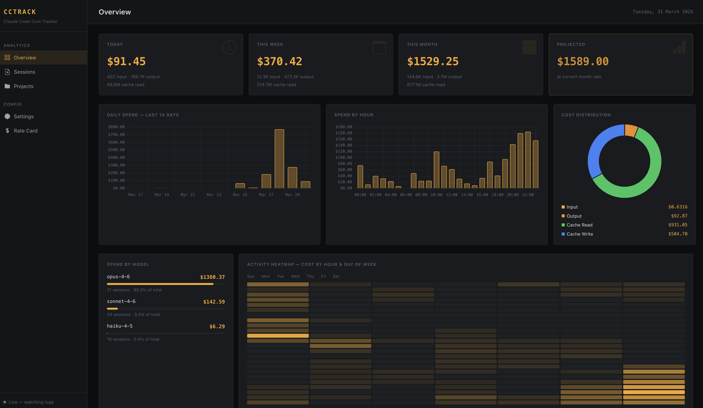
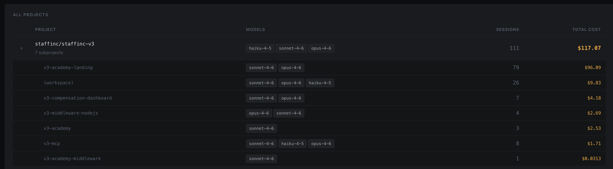

# cc-cost

Real-time cost tracker for [Claude Code](https://claude.ai/code). Shows what you would pay at pay-as-you-go API rates, broken down by project, model, and token type — updated live as you work.



---

## How it works

Claude Code writes detailed JSONL logs to `~/.claude/projects/` after every API call — every request, every token count, every model used. cc-cost reads those logs in real-time and calculates equivalent API costs using Anthropic's public pricing.

**This is not what you're billed.** If you're on Claude Max subscription, you pay a flat monthly fee. This shows what the same usage would cost at pay-as-you-go API rates — useful for understanding your usage patterns and model selection.

---

## Architecture

```
Rust backend (port 8080)          Go frontend (port 45123)
────────────────────────          ───────────────────────
~/.claude/projects/ watcher  ───► Go templates + HTMX
JSONL parser + dedup         ←──  REST API calls (SSR)
REST API + WebSocket         ────► Browser WebSocket
                                   Chart.js charts
```

- **Rust** handles all the data work: parsing, deduplication, cost calculation, file watching, WebSocket broadcast
- **Go** serves the HTML dashboard with server-side rendering; the browser connects directly to the Rust WebSocket for live updates
- Dashboard refreshes within ~500ms of Claude Code writing new logs

---

## Requirements

- macOS or Linux
- [Claude Code](https://claude.ai/code) installed and used (logs must exist at `~/.claude/projects/`)
- Rust and Go (installed automatically by `make install` if missing)

---

## Quick start

```bash
git clone <repo-url> cc-cost
cd cc-cost

make install   # installs Rust (via rustup) and Go (via brew/apt) if needed
make dev       # builds and starts both servers, opens browser
```

That's it. The dashboard opens at **http://localhost:45123**.

---

## Commands

| Command | Description |
|---|---|
| `make install` | Install Rust and Go if not present |
| `make dev` | Start both servers (dev mode, auto-recompiles on change) |
| `make run` | Build release binaries and run |
| `make build` | Build release binaries only |
| `make install-service` | Install as background service, auto-start on login |
| `make uninstall-service` | Remove background service |
| `make service-status` | Check if services are running |
| `make clean` | Remove build artifacts |

---

## Dashboard

| View | What it shows |
|---|---|
| **Overview** | Stat cards (today / week / month / projected), daily spend chart, hourly spend chart, cost distribution donut, model breakdown, activity heatmap, recent sessions |
| **Sessions** | All sessions sorted by last active, with project, model, token count, cost |
| **Projects** | Per-project total cost, session count, models used |
| **Rate Card** | Current pricing table used for calculations |

---

## Pricing

Costs are calculated using Anthropic's public list prices as of 2026:

| Model | Input | Output | Cache Write | Cache Read |
|---|---|---|---|---|
| claude-opus-4 | $15/MTok | $75/MTok | $18.75/MTok | $1.50/MTok |
| claude-sonnet-4 | $3/MTok | $15/MTok | $3.75/MTok | $0.30/MTok |
| claude-haiku-4 | $0.80/MTok | $4/MTok | $1.00/MTok | $0.08/MTok |

Model date suffixes (e.g. `claude-opus-4-6-20250514`) are stripped automatically.

---

## Notes on accuracy

- **Deduplication**: Claude Code streams each API response as multiple JSONL events sharing a `requestId`, each with cumulative token totals. cc-cost keeps only the final event per request. The same `requestId` can also appear in both a session file and its subagent file — cc-cost deduplicates globally across all files.
- **Nested repos**: If a workspace contains multiple Git repositories, cc-cost detects subprojects by scanning for nested `.git` directories under the workspace root. It keeps the parent workspace total and breaks usage down into those subprojects using file paths touched in Claude tool calls. Requests that touch multiple subprojects are split evenly so the subproject totals add back up to the parent project total.

  

- **Scope**: Only captures Claude Code CLI sessions (`~/.claude/projects/`). Programmatic API calls from your own services do not appear here.
- **Pricing**: Uses public list prices. Actual console billing may differ slightly due to pricing updates or rounding.

---

## Ports

| Service | Default | Override |
|---|---|---|
| Rust backend | `8080` | `PORT=8080 ./cc-cost-backend` |
| Go frontend | `45123` | `FRONTEND_ADDR=:45123 ./cc-cost-frontend` |
| Backend URL (frontend uses) | `http://localhost:8080` | `BACKEND_URL=http://localhost:8080 ./cc-cost-frontend` |

---

## Linux

`make install` auto-detects `apt`, `pacman`, or `dnf` for installing Go. Rust is installed via `rustup` on all platforms. If your package manager isn't detected, install Go manually from [go.dev/dl](https://go.dev/dl/) then run `make dev`.
